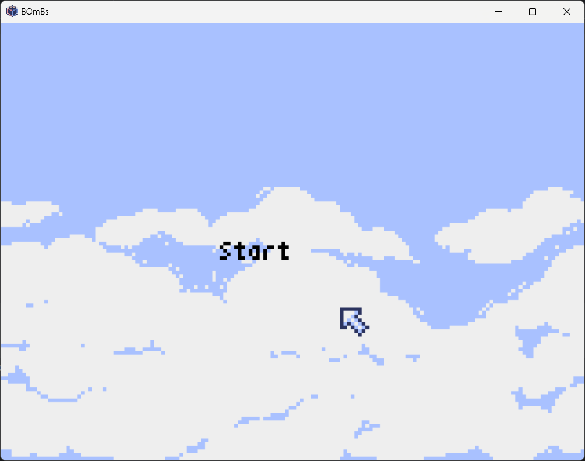
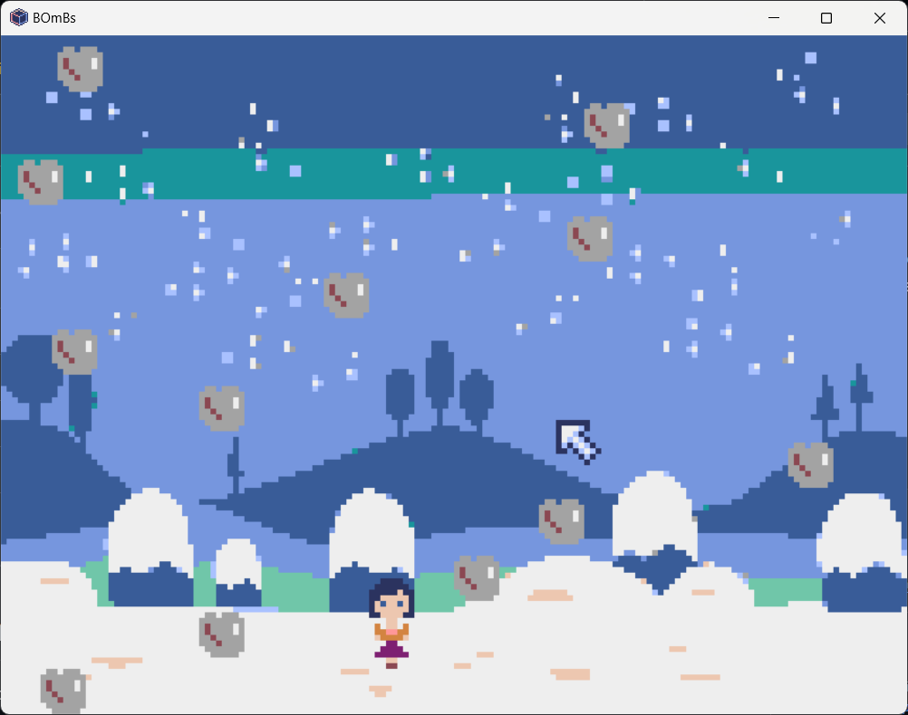

# 2D retro Game made with pyxel engine
A console like 2d pixelated game 
(will be adding select difficulty feature soon).

A simple pixelated retro-style game made using the [Pyxel](https://github.com/kitao/pyxel) engine.  
In this game, rocks fall from the top and the player must dodge them by moving left and right.  

🕹️ Difficulty selection feature coming soon!

---

## 🖥️ Start Screen

---

## 🎮 Gameplay Demo

---

## 🧠 Game Description

- The player controls a character using the **left** and **right arrow keys**.
- The goal is to **dodge the falling rocks** and survive as long as possible.
- Game ends when the player gets hit.

---

## ⚙️ How to Play

1. Clone or download the repo.
2. Install Pyxel (if not already installed):
3. Run the script.
